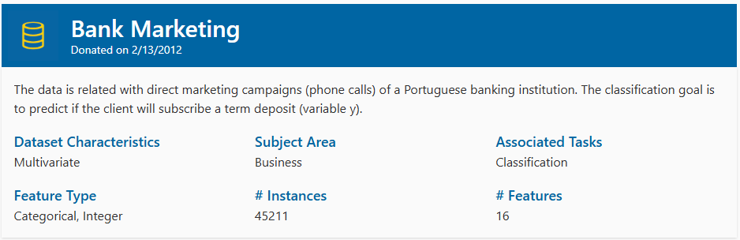

# ML Assignment 2 – Bank Marketing Classification

## 🔍 Problem Statement

The objective of this project is to build and compare multiple machine learning models to predict whether a client will subscribe to a term deposit based on marketing campaign data.

The target variable:
- `y = 1` → Client subscribed to term deposit
- `y = 0` → Client did not subscribe

---

## 📊 Dataset

Dataset: Bank Marketing Dataset (UCI)

- Total records: 45,211
- Features: 16 input features
- Target: Binary classification (`yes` / `no`)
- Class imbalance:
  - No ≈ 88%
  - Yes ≈ 12%

Due to class imbalance, multiple evaluation metrics were used instead of relying only on accuracy.

---
## 📊 Dataset



- Target: Binary classification (`yes` / `no`)
- Class imbalance:
  - No ≈ 88%
  - Yes ≈ 12%
- Source: https://archive.ics.uci.edu/dataset/222/bank+marketing

Due to class imbalance, multiple evaluation metrics were used instead of relying only on accuracy.

---

## 📁 Project Structure

```
ML_Assignment2_BankMarketing/
│
├── streamlit_app.py
├── requirements.txt
├── README.md
│
├── data/
│   └── bank-full.csv
│
├── notebooks/
│   └── exploration.ipynb
│
├── model/
│   ├── preprocessing.py
│   ├── evaluate.py
│   ├── train_models.py
│   ├── logistic_regression_model.pkl
│   ├── decision_tree_model.pkl
│   ├── knn_model.pkl
│   ├── naive_bayes_model.pkl
│   ├── random_forest_model.pkl
│   ├── xgboost_model.pkl
│   ├── sample_test_data.csv
│   └── sample_test_with_target.csv
```


## ⚙️ Models Implemented

Six classification models were implemented and compared:

1. Logistic Regression  
2. Decision Tree  
3. K-Nearest Neighbors (KNN)  
4. Naive Bayes  
5. Random Forest  
6. XGBoost  

All models were built using a shared preprocessing pipeline:
- One-hot encoding for categorical variables
- Standard scaling for numerical variables
- Stratified train-test split (80/20)

---

## 📈 Evaluation Metrics

The following metrics were used:

- Accuracy
- Precision
- Recall
- F1 Score
- AUC (ROC)
- Matthews Correlation Coefficient (MCC)

Accuracy alone was not sufficient due to class imbalance.

---

## 🏆 Model Comparison (Test Set)

| Model | Accuracy | AUC | F1 Score | MCC |
|-------|----------|------|----------|------|
| Logistic Regression | 0.846 | 0.908 | 0.553 | 0.509 |
| Decision Tree | 0.878 | 0.713 | 0.488 | 0.419 |
| KNN | 0.896 | 0.837 | 0.444 | 0.407 |
| Naive Bayes | 0.864 | 0.809 | 0.456 | 0.380 |
| Random Forest | 0.904 | 0.927 | 0.486 | 0.456 |
| XGBoost | **0.908** | **0.929** | **0.561** | **0.515** |

---

## 📌 Key Observations

- **XGBoost** achieved the best overall performance across Accuracy, AUC, F1 Score, and MCC.
- **Logistic Regression** achieved the highest Recall, making it suitable when minimizing false negatives is important.
- Tree-based ensemble methods (Random Forest, XGBoost) handled class imbalance better than simple models.
- Accuracy alone would have been misleading due to the 88/12 class distribution.

## 📊 Model-wise Performance Observations

| ML Model Name | Observation about model performance |
|---------------|--------------------------------------|
| **Logistic Regression** | Achieved strong AUC (0.908) and the highest Recall (~0.81), meaning it correctly identifies most subscribing clients. However, Precision is moderate, indicating more false positives. Suitable when minimizing missed potential subscribers is important. |
| **Decision Tree** | Shows improved Accuracy compared to Logistic Regression but relatively low AUC (0.713), indicating weaker ranking ability. Tends to overfit and does not generalize as well as ensemble methods. |
| **KNN** | Achieves high Accuracy but relatively low Recall, meaning it misses many actual subscribers. Performance is sensitive to class imbalance and feature scaling. Not ideal for this dataset. |
| **Naive Bayes** | Provides balanced but moderate performance across metrics. Assumes feature independence, which may not hold in this dataset, leading to limited predictive strength compared to ensemble models. |
| **Random Forest (Ensemble)** | Improves Accuracy and AUC significantly compared to single Decision Tree. Handles non-linear relationships well. However, Recall is lower than Logistic Regression, meaning it misses some subscribers. |
| **XGBoost (Ensemble)** | Best overall performer with highest Accuracy (0.908), AUC (0.929), F1 Score, and MCC. Provides the best balance between Precision and Recall. Most robust model for this dataset. |

---

## 💻 Streamlit Application

The deployed application allows:

- Model selection via dropdown
- Downloading a sample test dataset
- Uploading a custom test dataset (CSV)
- Viewing:
  - Evaluation metrics
  - Confusion matrix (heatmap)
  - Tabulated classification report
  - Downloadable predictions

### 🔗 Live App:
https://2025aa05719-nitin-shriram-kabra-ml-assignment2.streamlit.app/

---

## 📦 Installation (Local Run)

```bash
pip install -r requirements.txt
python -m streamlit run streamlit_app.py
